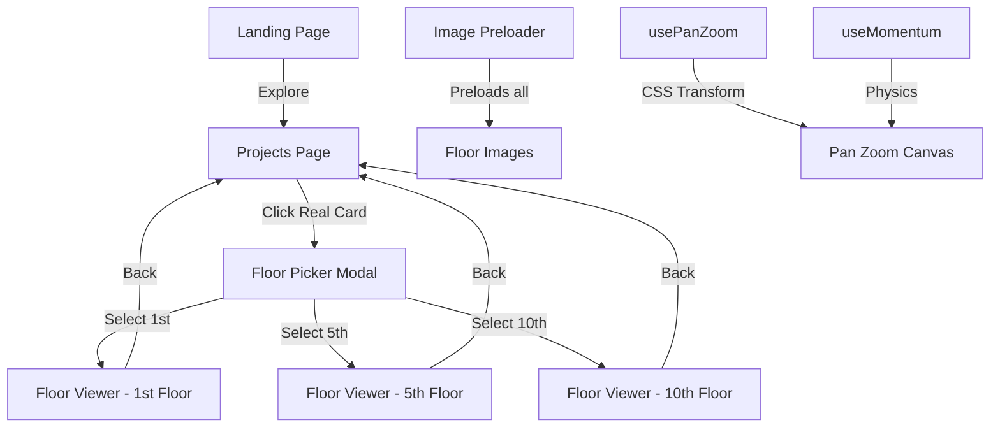

# Outside View — Luxury Tower View Simulator

A premium real estate POC that lets users explore panoramic balcony views from different floors of a luxury tower. The experience flows from a landing page through a projects listing to a full-screen floor viewer with pan, zoom, and day/night toggles.

## Overview

Outside View is a single-page React application that simulates the view from luxury apartment balconies at different floor heights. It serves as an interactive marketing tool for real estate developments, allowing prospective buyers to visualize their future view before purchase.

## Use Cases

- **Real Estate Marketing** — Prospective buyers explore floor-by-floor views before making purchase decisions
- **Pre-Launch Engagement** — Generate interest in properties under construction by showcasing planned views
- **Floor Comparison** — Users can compare views from different elevations (1st, 5th, 10th floor) to decide which floor best suits their preferences
- **Day/Night Visualization** — Toggle between day and night views to understand how lighting and scenery change throughout the day

## Tech Stack

| Layer | Technology |
|-------|------------|
| **Framework** | React 18 with JSX |
| **Build Tool** | Vite 6 |
| **Styling** | Vanilla CSS with CSS Custom Properties |
| **Fonts** | Playfair Display (headings), Inter (body) — via Google Fonts |
| **Type** | Static, client-side only — no backend required |

## Architecture

```
┌─────────────────────────────────────────────────────────┐
│                         App                             │
│  (view state router: 'landing' | 'projects' | 'viewer') │
└────────────┬──────────────────┬──────────────────────────┘
             │                  │
    ┌────────▼────────┐  ┌───────▼────────┐
    │   LandingPage   │  │  ProjectsPage │
    │                 │  │               │
    │  HeroSection    │  │  ProjectCard[] │
    │  FloorCard[]    │  └───────┬───────┘
    │  Footer         │          │ click
    └─────────────────┘          ▼
                       ┌──────────────────┐
                       │  FloorPickerModal │
                       │  (1st, 5th, 10th) │
                       └───────┬──────────┘
                               │ select floor
                               ▼
                       ┌──────────────────┐
                       │   FloorViewer    │
                       │                  │
                       │  ImageViewport  │
                       │  DayNightToggle  │
                       │  CategoryFilter  │
                       │  POIPin[]        │
                       └──────────────────┘
```



## Getting Started

```bash
# Install dependencies
npm install

# Start development server (port 3000)
npm run dev

# Build for production
npm run build

# Preview production build
npm run preview
```

## Project Structure

```
src/
├── main.jsx              # React root mount
├── App.jsx               # Root component + view routing
├── index.css             # Global styles, CSS vars, animations
├── components/
│   ├── FloorViewer/      # Full-screen panorama viewer
│   ├── FloorPickerModal/ # Floor selection overlay
│   ├── LandingPage/      # Hero + floor cards
│   └── ProjectsPage/     # Project listing with parallax
├── hooks/
│   ├── useImagePreloader.js
│   ├── useMomentum.js
│   └── usePanZoom.js
└── data/
    ├── floors.js         # Floor definitions
    ├── pois.js           # Points of interest
    └── projects.js       # Project listings
```